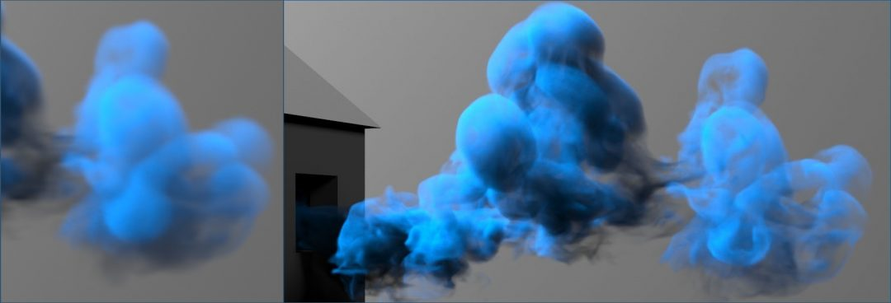

# tempoGAN
Here you can find the source code for the SIGGRAPH paper "tempoGAN: A Temporally Coherent, Volumetric GAN for Super-resolution Fluid Flow".
Authors: You Xie, Erik Franz, MengYu Chu, Nils Thuerey. Technical University of Munich.

Below you can find a quick intro how to get started with the source code,
in addition to clarifications regarding the main paper.

You can also check out further details our TUM lab homepage: https://ge.in.tum.de/publications/tempoGAN/ 



# Getting started
This is a brief overview and getting-started guide for the source code of 
the tempoGAN project. It can also be found under tempoGAN/tensorflow/tempoGAN/README.txt.

## Software
Note: tensorflow 1.3 or higher is required to run.

## Directories
Main source code directories:

`.../tensorflow/datagen:` scene files for generating 2D/3D training data

`.../tensorflow/tools:`   contains necessary tools for inputs, outputs, 
					    neural networks operation, and etc.

`.../tensorflow/GAN:`     contains the tempoGAN model.

And two data directories were ouputs will be written:

`.../tensorflow/2ddata_sim:` contains the training, validation and test data

`.../tensorflow/2ddata_gan:` outputs will be written here

## Compilation
First, compile mantaflow with numpy support (as usual), follow 
http://mantaflow.com/install.html.
One difference is, in the CMake settings, numpy shoule be enabled: 
"cmake .. -DGUI=ON -DOPENMP=ON -DNUMPY=ON".
Note that if mantaflow is installed on a remote server, GUI is not supported, i.e.:
"cmake .. -DGUI=OFF -DOPENMP=ON -DNUMPY=ON".

All of the following scripts assume that you execute them 
from the mantaflow/tensorflow/tempoGAN/ directory (they often
use relative paths).

## Data Generation
Then generate simulation data with the following command, e.g.:

`manta ../datagen/gen_sim_data.py basePath ../2ddata_sim/ reset 1 savenpz 1`

You can add "gui 0" on the command line to hide the UI and speed up the data
generation runs. Also generate the sample plume data (gen_sim_2006.py for 2D,
gen_sim_3006.py for 3D) into the 2ddata_sim directory.

## Training
Then you can start to train a GAN using:

`python example_run_training.py`

This trains four models, for a quick test disable the later three. These
example only use 2 simulations as training data. To train proper models, we
recommend ca. 200 frames of input from at least 10 sims.

## Applying the Model
After you trained a GAN model, you can use the model to generate new outputs:

`python example_run_output.py`

By default, these examples run on simulation "2006" and "3006" for 3D.

Note: all the commands above are just examples, please check parameters when
running them (esp. paths, simulation ID ranges etc.). The code currently uses
.uni files for reading and writing grids. This is the default file format of
mantaflow, so you can check out the sources at http://mantaflow.com/ 
for details on how to read and write these files.

## BibTex citation

If you find this work useful, please consider citing the corresponding paper:

```
@article{xie2018tempoGAN,
    title={tempoGAN: A Temporally Coherent, Volumetric GAN for Super-resolution Fluid Flow},
    author={Xie, You and Franz,Erik and Chu, Mengyu and Thuerey, Nils},
    journal={ACM Transactions on Graphics (TOG)},
    volume={37},
    number={4},
    pages={95},
    year={2018},
    publisher={ACM}
}
```
